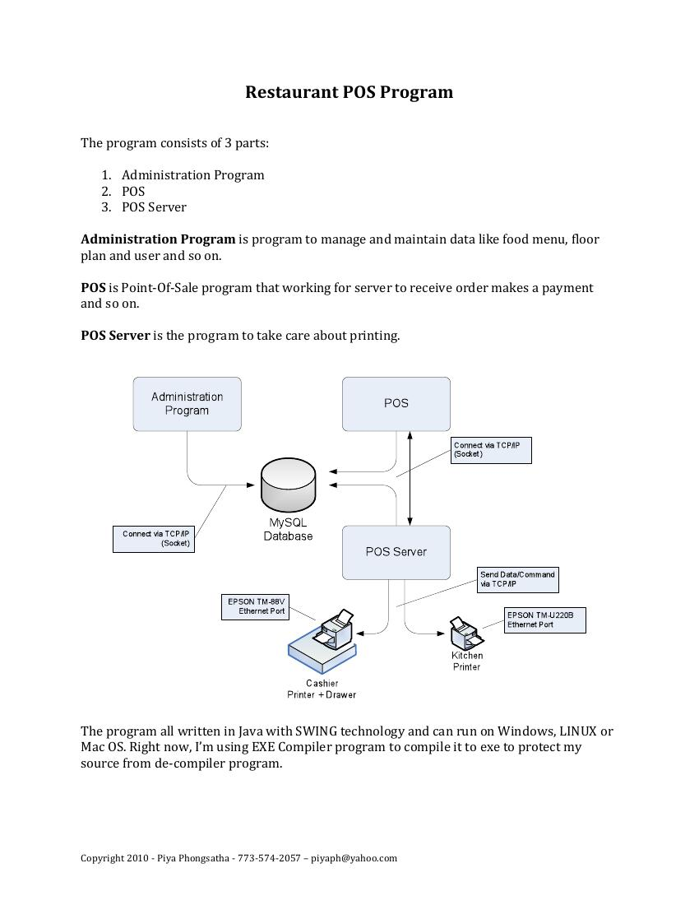
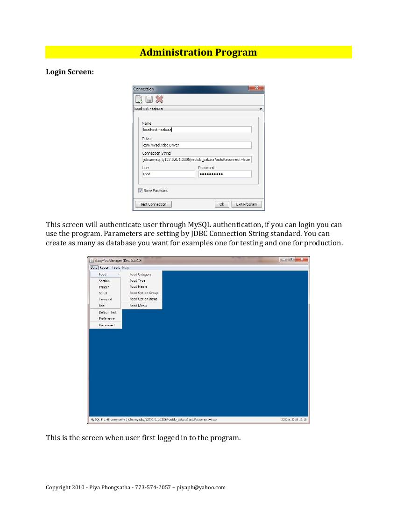
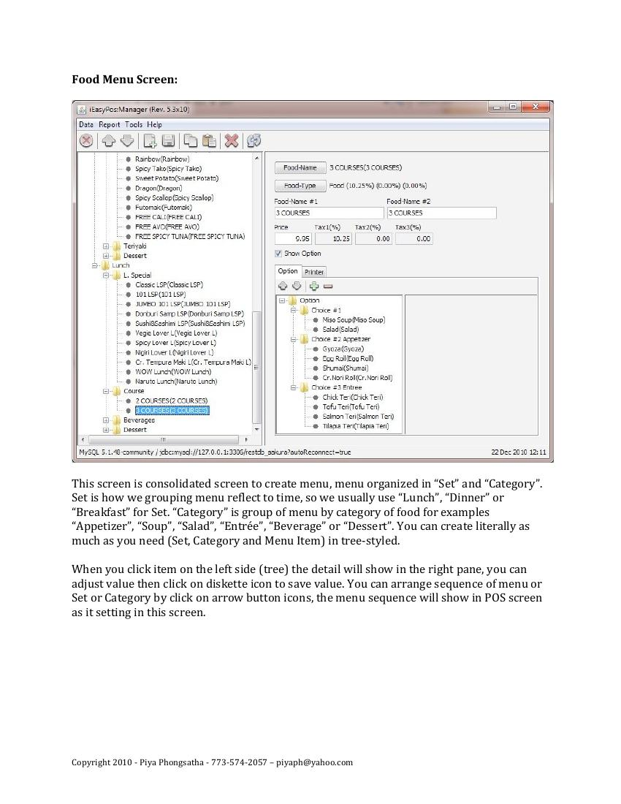
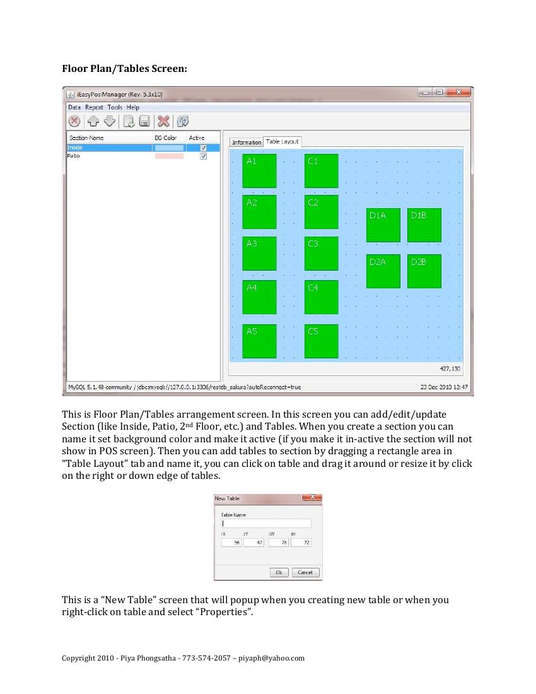
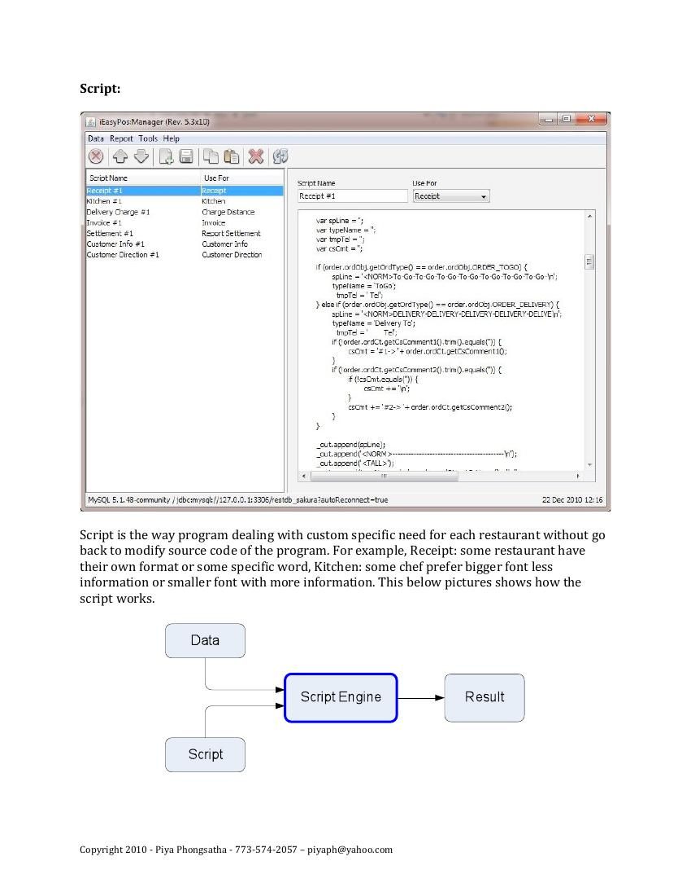
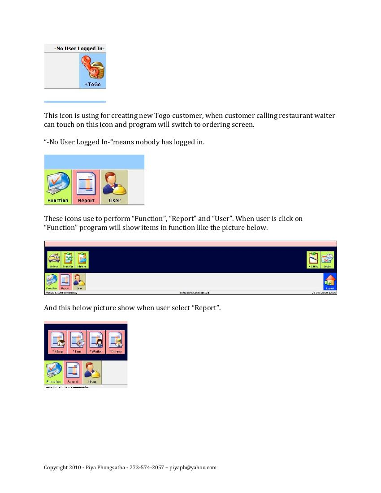

# iEasyPos:Manager - Restaurant Point-of-Sale System

A full point-of-sale system built in Java (Swing) for restaurant operations.

## Overview

The system is split into three cooperating Java Swing/desktop applications, all talking to a shared MySQL backend and to physical hardware (Epson receipt/kitchen printers) over the network:

| Program | Role |
|---|---|
| **Administration Program** | Manages food menu, floor plan/table layout, users, printers, and custom "scripts" (see below) |
| **POS** | The front-of-house terminal servers use to take orders, manage tables, and process payments |
| **POS Server** | Background service that handles print routing to networked receipt/kitchen printers |



All three programs connect to MySQL via TCP/IP socket, and the POS Server communicates with EPSON TM-series printers over their Ethernet interface (no local print drivers required) using a custom TCP/IP print protocol.

## Key engineering features

- **Custom scripting engine** - rather than hard-coding receipt formats, kitchen ticket layouts, or delivery-charge calculations per restaurant, the system embeds a small script engine (Java's Rhino JS engine) so each restaurant's specific formatting/business rules can be customized without touching the program's source code.
- **Dynamic floor plan editor** - drag-and-drop table layout editor with sections (Inside, Patio, etc.), live table status (available/occupied), and per-table sizing/positioning.
- **Hierarchical menu builder** - tree-based menu editor (Set > Category > Item) supporting nested modifiers/options per item, tax rates, and multiple names per item.
- **Role-based user/staff permissions** - PIN-code login for waitstaff with granular permission flags (Order, Delete, Discount, Report, Settlement, Driver).
- **Hardware integration** - direct network communication with EPSON TM-88V (cashier) and TM-U220B (kitchen) printers over Ethernet, with per-restaurant printer configuration.
- Runs cross-platform (Windows, Linux, macOS) since it's a pure Java Swing application.

## Screenshots

**Admin - Login & connection setup**


**Admin - Food menu builder (tree-based, nested categories/options)**


**Admin - Floor plan / table layout editor**


**Admin - Custom scripting engine (per-restaurant receipt/kitchen ticket formatting)**


**POS - Terminal screen (table selection, section/togo/internet order types)**


## Tech stack

- Java (Swing) - all three programs
- MySQL - shared backend database
- TCP/IP sockets - inter-program communication and printer communication
- Rhino (Java's embedded JavaScript engine) - custom scripting layer

## Documentation

Full user's manual (program directory, all screens, and setup instructions): [`iEasyPos_Manual.pdf`](iEasyPos_Manual.pdf)

---
Originally built in 2010-2011. Copyright Piya Phongsatha.

## Source code in this repository

The `src/` folder contains the Java Swing source for the **POS terminal** and the **Administration program**, plus the shared data layer.

| Package | Role |
|---|---|
| `app_pos` | POS terminal UI: floor plan and tables, order entry, split checks, payments, tips, shift reports |
| `app_admin` | Administration UI: menu, categories, options, printers, sections/floor plan, users |
| `resrc`, `model` | MySQL access, configuration loading, domain model |
| `print` | Receipt and kitchen slips (Star printers via JavaPOS; configured in `cfg/jpos.xml`) |
| `loader`, `test`, `game` | Menu loader, manual test harnesses, a small Snake easter egg |

This snapshot has no standalone print-server process: both programs talk to MySQL directly, and printing is done from the POS terminal.

### Build and run

Requirements: JDK 7+ and MySQL 5.x.

1. Create a MySQL database and a least-privilege user (see `notes/notes.txt`). Copy `cfg/config.ini.example` to `cfg/config.ini` and fill in the connection string, user and password. `config.ini` is git-ignored.
2. Compile with the jars in `lib/` (or import the folder into Eclipse as an existing project):
   ```
   javac -encoding UTF-8 -cp "lib/*;lib/starprn/*" -d bin <all .java files under src/>
   ```
3. Run `run_pos.bat` (POS terminal) or `run_admin.bat` (Admin program).

Google Maps address preview needs your own key: set `maps_api_key` in `cfg/config.ini`. Credentials and site-specific data have been removed from this repository.
